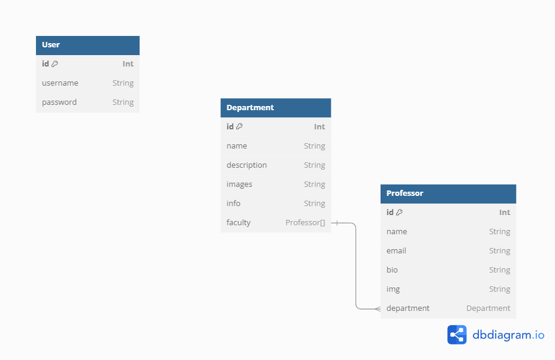

# fsu-backend

1. Create a new Postgres database named FSU.
2. Initialize Prisma and connect it to the database.
3. Define the models according to the schema above.
4. The username of a User must be unique.
5. Seed the database with at least 20 professors
6. Seed the database with 5 departments

### API

Build an Express app that serves the following routes.

The 🔒 lock icon next to a route indicates that it must be a protected route. A user can only access that route by attaching a valid token to their request. If a valid token is not provided, immediately send a 401 Unauthorized error.

### Authentication routes

1. POST /register creates a new User with the provided credentials and sends a token
   request body should include username and password
   the password should be hashed in the database

2. POST /login sends a token if the provided credentials are valid
   request body should include username and password

### Department Routes

- GET/departments sends the array of all the university's departments

- GET/departments/id sends specific department include the list of
  faculty in the department

- 🔒 POST/department creates a new department
  ✔️the request body has to include name, description, image, and info

- 🔒 DELETE/department/id Deletes the department with the given id

- 🔒 PATCH/deparment/id change the details of a department
  ✔️ The body has to include the name, description, and banner image

- 🔒 PATCH/department/id add or remove professor from a faculty
  ✔️ the body has to include professors ids

### FACULTY ROUTES

- GET/faculty sends an array of all faculty

- GET/faculty/id sends a single professor including all the details and the department this professor belongs to

- 🔒 POST/faculty creates a new professor
  ✔️ the body must include name, email, bio, image, departmentId

- 🔒 DELETE/faculty/id delete a professor with the given id

- 🔒 PATCH/faculty/id updates the professor's info
  ✔️ the body must include name, email, bio, image

- 🔒 PATCH/faculty/id change the department an existing professor belongs to
  ✔️ the body must include the departmentId

### Backend

- Define a database schema that captures all the necessary information
- Seed the database with dummy data
- Build API routes to serve the data
- Build API routes to add/remove records
- Build API routes to update existing records
# backend-fsu
# backend-fsu
